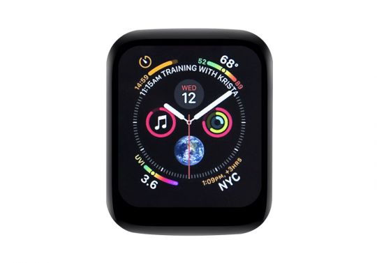

  <h1>ESP32-S3-Touch-LCD-1.69</h1>
  
<strong>ESP32-S3 1.69-inch 240 x 280 SPI LCD touch development board</strong>

  

    
    
    
  

  

    <a href="README_ZH.md">中文</a> ·
    <a href="https://www.waveshare.com/esp32-s3-touch-lcd-1.69.htm">🌐 Product Page</a> ·
    <a href="https://docs.waveshare.com/ESP32-S3-Touch-LCD-1.69">📚 Documentation</a> ·
    <a href="https://github.com/waveshareteam/ESP32-S3-Touch-LCD-1.69/releases/latest">📦 Firmware Releases</a> ·
    <a href="examples/esp-idf/">🧩 ESP-IDF Examples</a> ·
    <a href="examples/arduino/">🔧 Arduino Examples</a>
  

  

---

## ✨ Overview

This repository provides first-party examples, ready-to-flash source-built
firmware packages, factory recovery firmware, schematics, pinout drawings, and
mechanical references for the Waveshare ESP32-S3-Touch-LCD-1.69.

The board combines an ESP32-S3 with a compact color LCD, capacitive touch,
motion sensing, real-time clock, battery management, and expansion interfaces
for wearable devices, smart terminals, and interactive control panels.

## 🖥️ Hardware Overview

| Feature | Device / interface |
| --- | --- |
| MCU | ESP32-S3R8, dual-core Xtensa LX7 at 240 MHz |
| Memory | 16 MB Flash and 8 MB PSRAM |
| Wireless | 2.4 GHz Wi-Fi and Bluetooth 5 LE |
| Display | 1.69-inch 240 x 280 SPI LCD using ST7789V2 |
| Touch | CST816T capacitive touch controller over I2C |
| Motion sensor | QMI8658C six-axis IMU over I2C |
| Real-time clock | PCF85063ATL over I2C |
| Power | ETA6098 single-cell lithium battery charge/discharge management and battery voltage sampling |
| User interfaces | Onboard buzzer, USB Type-C, and BOOT / power buttons |
| Expansion | 5 V, 3.3 V, GND, I2C, UART, and GPIO signals |
| Board support | Available managed BSP: [`waveshare/esp32_s3_touch_lcd_1_69`](https://github.com/waveshareteam/Waveshare-ESP32-components/tree/master/bsp/esp32_s3_touch_lcd_1_69) |
| Hardware files | [Schematics](hardware/schematics/), [pinout](hardware/pinout/), and [mechanical dimensions](hardware/dimensions/) |

For complete GPIO assignments and I2C addresses, see the
[Hardware Reference](HARDWARE_REFERENCE.md).

## 📦 Firmware Releases

The fastest way to try an example is to use a ready-to-flash package from the
[latest release](https://github.com/waveshareteam/ESP32-S3-Touch-LCD-1.69/releases/latest).

1. Download the `.zip` package for the example and framework version you need.
2. Extract the archive and install esptool with
   `python -m pip install esptool`.
3. Connect the board over USB.
4. Run `flash.bat COMx` on Windows or `./flash.sh /dev/ttyACM0` on Linux.
5. Reset the board if it does not restart automatically.

> [!NOTE]
> The combined image is flashed at offset `0x0`. Each package also contains the
> original binaries, flash arguments, helper scripts, and a firmware manifest.

Factory recovery images under [`firmware/`](firmware/) are separate from the
source-built example packages. See
[Firmware and Factory Recovery](docs/firmware.md) for details.

## 🧪 Examples

### ESP-IDF

| Example | Focus |
| --- | --- |
| [01_ESP_IDF_ST7789](examples/esp-idf/01_ESP_IDF_ST7789/) | ST7789V2 LCD bring-up |
| [02_ESP_IDF_ST7789_LVGL](examples/esp-idf/02_ESP_IDF_ST7789_LVGL/) | LVGL display and CST816T touch integration |
| [03_PCF85063](examples/esp-idf/03_PCF85063/) | PCF85063 real-time clock |
| [04_QMI8658](examples/esp-idf/04_QMI8658/) | QMI8658 six-axis IMU |

### Arduino

| Example | Focus |
| --- | --- |
| [01_HelloWorld](examples/arduino/01_HelloWorld/) | Arduino GFX display bring-up |
| [02_Drawing_board](examples/arduino/02_Drawing_board/) | Capacitive-touch drawing board |
| [03_GFX_AsciiTable](examples/arduino/03_GFX_AsciiTable/) | GFX text and character rendering |
| [04_GFX_ESPWiFiAnalyzer](examples/arduino/04_GFX_ESPWiFiAnalyzer/) | Wi-Fi scanning and channel visualization |
| [05_GFX_Clock](examples/arduino/05_GFX_Clock/) | Graphical clock rendering |
| [06_GFX_PCF85063_simpleTime](examples/arduino/06_GFX_PCF85063_simpleTime/) | PCF85063 RTC with GFX output |
| [07_LVGL_Measuring_voltage](examples/arduino/07_LVGL_Measuring_voltage/) | LVGL battery-voltage monitor |
| [08_LVGL_PCF85063_simpleTime](examples/arduino/08_LVGL_PCF85063_simpleTime/) | PCF85063 RTC with an LVGL interface |
| [09_LVGL_Keys_Bee](examples/arduino/09_LVGL_Keys_Bee/) | Button gestures and buzzer feedback |
| [10_LVGL_QMI8658_ui](examples/arduino/10_LVGL_QMI8658_ui/) | LVGL IMU data visualization |
| [11_LVGL_Arduino](examples/arduino/11_LVGL_Arduino/) | LVGL widgets with display and touch input |

Bundled Arduino libraries live under
[`examples/arduino/libraries/`](examples/arduino/libraries/). Their upstream
library examples are intentionally excluded from the product CI matrix.

## 🛠️ Supported Toolchains

| Surface | Version | Firmware builds |
| --- | --- | ---: |
| ESP-IDF | `v5.5.4` | 4 |
| ESP-IDF | `v6.0.2` | 4 |
| Arduino-ESP32 | `3.3.10` | 11 |

The [Build Examples workflow](https://github.com/waveshareteam/ESP32-S3-Touch-LCD-1.69/actions/workflows/examples.yml)
runs two discovery jobs and 19 firmware build jobs for the full matrix. Each
successful build is packaged as a flashable firmware artifact. See
[Continuous Integration](docs/ci.md) for matrix and dispatch details.

## 🗂️ Repository Layout

| Path | Purpose |
| --- | --- |
| [`examples/esp-idf/`](examples/esp-idf/) | First-party ESP-IDF projects |
| [`examples/arduino/`](examples/arduino/) | First-party Arduino sketches and bundled libraries |
| [`firmware/`](firmware/) | Factory flashing and recovery binary |
| [`releases/`](releases/) | Firmware packaging, artifact download, and release tools |
| [`hardware/`](hardware/) | Schematics, pinout, and mechanical reference files |
| [`config/`](config/) | Reserved for shared ESP-IDF configuration overlays |
| [`docs/`](docs/) | Repository, CI, component, and firmware notes |
| [`assets/`](assets/) | Product images used by documentation |

## 📚 Documentation

- [Product Documentation](https://docs.waveshare.com/ESP32-S3-Touch-LCD-1.69)
- [Hardware Reference](HARDWARE_REFERENCE.md)
- [Repository Structure](docs/repository-structure.md)
- [Continuous Integration](docs/ci.md)
- [Components](docs/components.md)
- [Firmware and Factory Recovery](docs/firmware.md)
- [Release Tools](releases/README.md)

## 🤝 Support and Contributions

Contributions and reproducible issue reports are welcome. Include the example
path, framework version, reproduction steps, expected behavior, actual
behavior, and relevant serial logs.

- [Contributing Guide](CONTRIBUTING.md)
- [Support](SUPPORT.md)
- [Security Policy](SECURITY.md)
- [Open an Issue](https://github.com/waveshareteam/ESP32-S3-Touch-LCD-1.69/issues/new/choose)

## 📄 License

This repository is licensed under the Apache License 2.0. See
[LICENSE](LICENSE).
