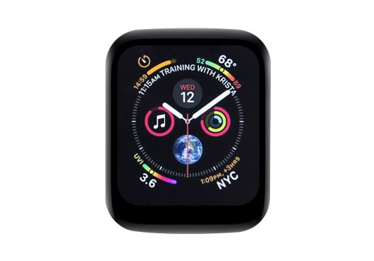

# Waveshare ESP32-S3-Touch-LCD-1.69 产品工程示例程序

[English](README.md)

ESP32-S3-Touch-LCD-1.69 集成了 1.69 英寸电容触摸屏、IMU、RTC、蜂鸣器、电池管理和扩展接口，提供 Arduino 与 ESP-IDF 示例程序，覆盖 LCD、触摸、传感器、RTC 和 LVGL 演示，助您轻松打造紧凑型智能人机交互终端。

- [购买链接](https://www.waveshare.net/shop/ESP32-S3-Touch-LCD-1.69.htm)
- [产品文档](https://docs.waveshare.net/ESP32-S3-Touch-LCD-1.69/)

---

## 🔧 配置

您可以在产品 Wiki 页面上找到详细的配置信息。

如需快速查看硬件信息，请参考 [HARDWARE_REFERENCE_ZH.md](HARDWARE_REFERENCE_ZH.md)，其中整理了板载外设、GPIO 分配、I2C 地址和扩展接口信号。

---

## 🛠️ 贡献

我们欢迎您的贡献！您可以通过以下方式提供帮助：

1. Fork 本仓库。
2. 为您的新功能或 Bug 修复创建一个新分支。
3. 提交您的更改并附上清晰的描述。
4. 提交 Pull Request 以供审核。

---

## 🧩 问题与支持

如果您遇到任何问题：

- 请先查看 [Issues](https://gitee.com/waveshare/esp32-s3-touch-lcd-1.69/issues) 版块。
- 创建一个新的 Issue 并提供详细信息。
- 参考文档获取故障排除提示。
- 联系微雪团队并提供订单号以获取技术支持。

---

## 📜 许可

本仓库遵循 Apache License 许可。详情请参阅 [LICENSE](LICENSE) 文件。

---

## 🙌 致谢

- 感谢微雪电子提供的优秀硬件平台和软件支持。
- 感谢乐鑫团队的持续支持。
- 感谢让这些项目成为可能的开源贡献者。

---

感谢您使用微雪电子产品！🚀
